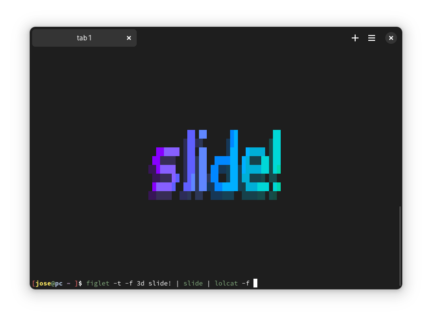

# slide
center text in the middle of the terminal

A while ago, I was trying to learn C, and as part of the process, I wrote this.

The idea originally came from this video: https://youtu.be/JsbkLqOIDcI. In it, the creator explains how to write a Bash script that achieves the same goal as this program.

This version also supports per-line text centering.

